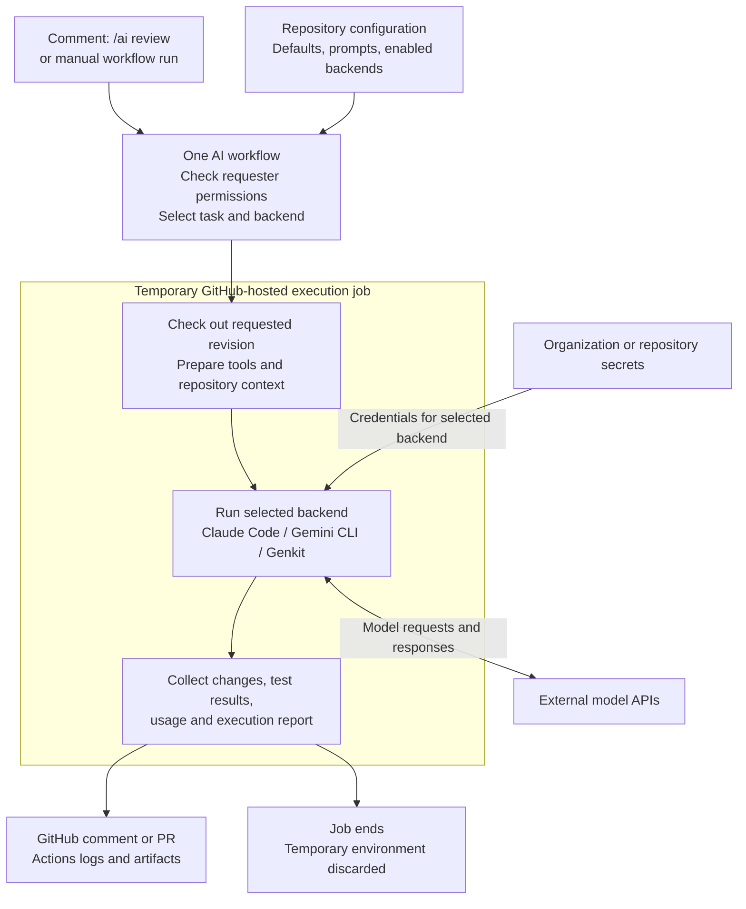

# Agentic Workflow

```mermaid
flowchart TD
    U["Comment: /ai review<br/>or manual workflow run"]
    C["Repository configuration<br/>Defaults, prompts, enabled backends"]
    S["Organization or repository secrets"]

    U --> W["One AI workflow<br/>Check requester permissions<br/>Select task and backend"]
    C --> W

    subgraph JOB["Temporary GitHub-hosted execution job"]
        P["Check out requested revision<br/>Prepare tools and repository context"]
        R["Run selected backend<br/>Claude Code / Gemini CLI / Genkit"]
        O["Collect changes, test results,<br/>usage and execution report"]
        P --> R --> O
    end

    W --> P
    S -->|"Credentials for selected backend"| R
    R <-->|"Model requests and responses"| M["External model APIs"]

    O --> G["GitHub comment or PR<br/>Actions logs and artifacts"]
    O --> X["Job ends<br/>Temporary environment discarded"]
```
