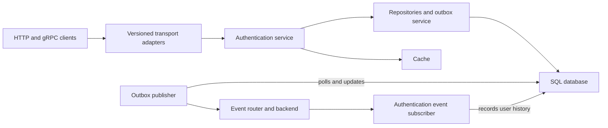

# Architecture

This guide describes the implementation in this checkout. The [application profile](project.md) records its purpose
and ownership gaps; [conventions](conventions.md#architecture-and-data) define the rules for changing the design.

## Components and boundaries

The [composition root](../../cmd/app/main.go) runs one Go process containing HTTP and gRPC servers, a shared authentication
service, persistence and cache adapters, an event router, and background workers.

The [HTTP adapters](../../internal/auth/adapters/http/v1) and [gRPC adapters](../../internal/auth/adapters/grpc/v1) translate
transport requests into service inputs. HTTP exposes signup, login, token refresh, logout, and user management; gRPC exposes
user management. The [OpenAPI contracts](../../api/openapi/v1) and [Protobuf contract](../../api/proto/auth/v1/auth.proto)
define those interfaces.

The [authentication service](../../internal/auth/auth.go) owns business operations, sessions, and token behavior.
Feature `domain/` packages hold service inputs and errors; `models/` packages hold persistence models; repositories own
database access. Dependency interfaces live beside their consumers.

## Requests and persistence

Services and worker handlers establish transaction boundaries through
[`WithTransaction`](../../internal/database/repository.go). They pass the resulting context to all participating
repository calls so a business write and its required outbox message commit or roll back together.

Repositories use the primary database for writes and reads requiring immediate consistency. `GetReadDB` can use the
configured replica where lag is acceptable; within a transaction it uses that transaction. Backend selection and
persistence defaults are documented in [configuration](configuration.md#storage-and-events).

For signup and user creation, update, and deletion, the authentication service records the user change and its event in
the same transaction. Login and logout record events on a best-effort basis after creating or revoking a session: an event
write failure is logged and does not undo the successful authentication operation. These events therefore do not provide
a complete audit guarantee for every operation.

## Event delivery

The [outbox service](../../internal/outbox/outbox.go) stores pending messages in the application's SQL database.
The [publisher](../../internal/outbox/workers/publisher.go) polls due messages, sends them through the
[event router](../../internal/events/router.go), and records successful publication. Transient failures remain pending
with a bounded exponential retry delay; permanent failures are marked failed.

Publication and the database update that marks a message processed are separate operations. A message can be delivered
again if publication succeeds but that update does not commit. Consumers must handle duplicate delivery.
The [authentication subscriber](../../internal/auth/workers/auth_events_subscriber.go) records user history and
deduplicates inserts by event ID in its [repository](../../internal/auth/repository/repository.go).

The router applies consumer retries and dead-letter handling. Outbox publication retries and consumer retries are
different stages: a processed outbox row establishes publication, while consumer completion must be observed separately.
The default `gochan` backend runs in process and is not durable. The `none` backend accepts and discards publication.
External broker options and provisioning settings are described in [configuration](configuration.md#storage-and-events).

## Background work

| Worker | Responsibility |
| --- | --- |
| Outbox publisher | Publish pending messages and record retry or completion state |
| Outbox cleaner | Remove processed messages after retention; retain pending and failed messages |
| Authentication event subscriber | Turn authentication events into user history records |
| Token usage updater | Persist buffered token usage information |
| Session cleaner | Remove sessions according to the configured retention policy |

The workers are implemented under [outbox](../../internal/outbox/workers) and [authentication](../../internal/auth/workers).
Their polling, batch, timeout, and retention settings are defined in the [configuration model](../../internal/config/config.go).

## Process lifecycle

Startup loads and validates configuration, initializes dependencies, and applies migrations before serving requests.
SQLite migrations use the application's database pool so an in-memory database survives migration initialization.
MySQL and PostgreSQL migrations run against the primary before opening the application's pool.

The composition root registers event subscriptions before starting the router and the outbox publisher. It then starts
HTTP and gRPC serving. Readiness includes database and cache checks; liveness tracks terminal serving and router failures.
Broker connectivity and completion of individual messages are not readiness checks.

On a termination signal, the process cancels its application context, becomes unready, waits for probe propagation,
and closes components within configured deadlines. A terminal server or router error fails liveness and readiness;
the process relies on supervision for restart and still waits for a signal to enter shutdown.
See [operations](operations.md) for probes, shutdown settings, and failure investigation.

## Evidence and open decisions

These flows are described by the current source and exercised by [authentication unit tests](../../internal/auth/auth_test.go),
[outbox publisher tests](../../internal/outbox/workers/publisher_test.go), and
[integration tests](../../tests/integration). Follow the [development workflow](development.md) to run the relevant suites.

Application-specific business boundaries, capacity targets, availability objectives, and production topology are still
undecided. Record required outcomes in requirements and significant choices in decisions; update this guide when they
change the implementation.
